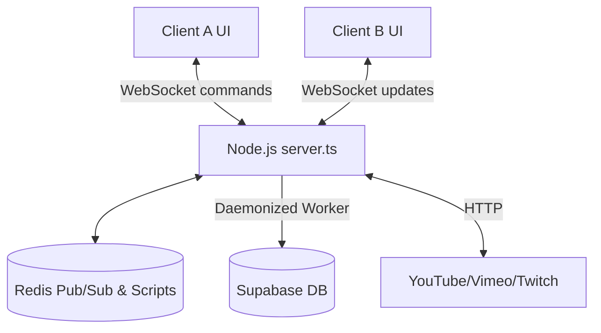

# SyncWatch

SyncWatch is a latency-tolerant, real-time, server-authoritative watch-party application. It coordinates synchronized media playback across multiple clients using an optimistic UI and strict server-side concurrency controls.

## What It Does

SyncWatch allows multiple users to watch videos (YouTube, Vimeo, Twitch, or direct media) together perfectly in sync. It solves the problem of "pause loops", rubber-banding, and state drift during collaborative viewing over unreliable networks by using Optimistic Concurrency Control (OCC) and dynamic NTP-style latency adjustments.

## Current Status

**Production-ish**

- The core synchronization, resilient database write-behind queues, and external media APIs are fully functional and stable.
- The project is thoroughly tested with both E2E (Playwright) and Unit/Integration (Vitest) suites.
- Code is resilient to DB downtime and handles temporary network partitions gracefully.

## Features

- **Server-Authoritative Synchronization**: Real-time websocket-based synchronization via `socket.io` and Lua OCC state machines.
- **Provider-Aware Resampling**: Supports YouTube, Vimeo, and Twitch via Next.js background API metadata resolvers with anti-SSRF safeguards.
- **Durable State Persistence**: Database writes are queued in a Redis write-behind queue and persisted efficiently to Supabase.
- **Dynamic Theme Engine**: Toggles between custom visual themes ("Cotton Candy Glassmorphism", "Cyber-Industrial Brutalist") via CSS variables.
- **Robust Security**: JWT-based session tokens, aggressive API Circuit Breakers, structured Zod validation for WebSockets, and sliding-window rate limiters.

## Non-Goals / Limitations

- **Stateless Serverless Hosting Limits**: Requires long-running Node.js processes for Socket.io. Traditional stateless serverless functions (like Vercel) are not adequate without external WS brokers.
- **Database Reliance**: Directly demands Supabase/PostgreSQL with `pgvector` and standard SQL schema constraints.

## Architecture

- **Frontend**: Next.js App Router, React 19, TailwindCSS v4, Zustand.
- **Backend (Stateless Gateway)**: Custom `server.ts` process runs `socket.io` alongside `next`.
- **Data Stores**:
  - _Redis_: Pub/Sub broker, atomic OCC state mutations, horizontal locking.
  - _Supabase_: Persistent record-keeping via a daemonized write-behind queue.



## Repository Structure

| Path          | Purpose                                                                           |
| ------------- | --------------------------------------------------------------------------------- |
| `app/`        | Next.js App Router endpoints, pages, and layout definitions.                      |
| `app/api/`    | Secure server-side HTTP routes (Metadata, YouTube Search, Auth).                  |
| `components/` | Reusable React UI components (`Player`, `TwitchPlayer`, `Playlist`, etc.).        |
| `hook/`       | Custom React hooks for application logic, including extracted sync engines.       |
| `lib/`        | Shared utilities (`room-handler.ts`, `db-sync.ts`), Zustand store, Redis clients. |
| `supabase/`   | Database migration files (e.g., `00001_initial.sql`).                             |
| `__tests__/`  | Unit and integration tests (Vitest).                                              |
| `e2e/`        | End-to-end user flow tests (Playwright).                                          |
| `server.ts`   | The core WebSocket server and Next.js host (delegates to `lib/room-handler`).     |
| `test-zod.ts` | Local CLI script for testing Zod schema behaviors.                                |

## Tech Stack

| Layer        | Technology                        | Purpose                                                    |
| ------------ | --------------------------------- | ---------------------------------------------------------- |
| Frontend     | Next.js, React, Tailwind, Zustand | UI rendering, client-side routing, and reactive state.     |
| Backend      | Node.js, Socket.io                | Bi-directional communication and API boundary.             |
| Caching/Sync | ioredis                           | Fast atomic operations, session management, and Pub/Sub.   |
| Database     | Supabase (PostgreSQL)             | Long-term durable storage of rooms and snapshots.          |
| Validation   | Zod                               | Strictly parsing incoming WS boundaries and external APIs. |
| Media        | ReactPlayer / Twitch.Player API   | Embedded media frames for YouTube/Vimeo/Twitch.            |

## Setup

1. Clone the repository and install dependencies:
   ```bash
   npm install
   ```
2. Configure your local database by running the script at `supabase/migrations/00001_initial.sql` in your Supabase SQL Editor.
3. Apply environment variables based on `.env.example` mapping.

## Configuration

| Variable                    | Required             | Default                                   | Description                                     | Used In              |
| --------------------------- | -------------------- | ----------------------------------------- | ----------------------------------------------- | -------------------- |
| `NEXT_PUBLIC_SUPABASE_URL`  | Yes                  | -                                         | URL of your Supabase instance.                  | Client / Server      |
| `SUPABASE_SERVICE_ROLE_KEY` | Yes                  | -                                         | Admin key to bypass RLS and persist states.     | Server               |
| `JWT_SECRET`                | Yes (implicitly)     | `"default_local_secret_dont_use_in_prod"` | Used to cryptographically sign session cookies. | Auth API             |
| `APP_URL`                   | Yes                  | -                                         | Public URL of the application.                  | Env Setup            |
| `GEMINI_API_KEY`            | No                   | -                                         | API key for experimental AI features.           | Server               |
| `YOUTUBE_API_KEY`           | No                   | -                                         | API key for YouTube video search fetching.      | YouTube Search API   |
| `REDIS_URL`                 | No (fallback exists) | -                                         | URI for Upstash or internal Redis instance.     | Rate limiter / Cache |

## Run

```bash
# Start development server with debugging (auto-compiled server.ts)
npm run dev

# Build the project for production
npm run build

# Start production server
npm start
```

## Scripts

| Command                 | Purpose                                                                |
| ----------------------- | ---------------------------------------------------------------------- |
| `npm run dev`           | Runs the Next.js app natively with TSX parsing the custom `server.ts`. |
| `npm run build`         | Compiles Next.js artifacts and type-checks the server bundle via TSC.  |
| `npm run start`         | Launches the built Node.js production server.                          |
| `npm run lint`          | Runs ESLint across the codebase.                                       |
| `npm run clean`         | Cleans Next.js build cache.                                            |
| `npm run format`        | Runs Prettier to auto-format the codebase.                             |
| `npm run prune`         | Runs Knip to resolve unused exports and files.                         |
| `npm run test:coverage` | Executes Vitest unit/integration tests with coverage tracking.         |

## Testing

- **Unit & Integration**: Validates React components and Zustand state isolation.
  - Tooling: Vitest + jsdom + v8 coverage
  - Command: `npm run test:coverage`
- **End-to-End (E2E)**: Simulates real browser websockets and UI operations.
  - Tooling: Playwright
  - Command: `npx playwright test`
- **Prerequisites**: E2E boots the app on `localhost:3001` natively inside Chromium test workers.

| Test Type        | Tooling    | Command                 | Scope                                          |
| ---------------- | ---------- | ----------------------- | ---------------------------------------------- |
| Unit/Integration | Vitest     | `npm run test:coverage` | Stores, components, background API resolution. |
| E2E              | Playwright | `npx playwright test`   | Multi-user WS sync, visual assertions.         |

## API / Events / Contracts

### HTTP Routes

- **`POST /api/auth/session`**: Validates `{ participantId }`, signs a JWT token, and injects session cookies.
- **`GET /api/metadata?url=...`**: Resolves URLs into safe video metadata structures. Protected against DNS Rebinding and local Bogon SSRF attacks via explicit `dns.resolve`.
- **`GET /api/youtube/playlist?listId=...`**: Resolves valid YouTube lists securely via `yt-search`.
- **`GET /api/youtube/search?q=...`**: Queries via primary Google API. Has an internal Circuit Breaker that falls back to a worker-thread `yt-search` orchestrator.

### WebSocket Commands (ingress via `socket.on("command")`)

All payloads are strictly parsed against `commandSchema` (Zod validation).

- **Fast Path (OCC sync-critical)**: `play`, `pause`, `seek`, `buffering`, `update_rate`, `sync_correction`.
- **Slow Path (Database-impacting)**: `add_item`, `add_items`, `remove_item`, `reorder_playlist`, `set_media`, `next`, `clear_playlist`.
- **Room Lifecycle**: `update_settings`, `upgrade_session`.

## Main User Flows

1. **Joining a Room**
   - _Preconditions_: User navigates to a shared room link.
   - _Steps_: The socket handshakes with a `join_room` invocation. The Node server validates OCC/lock integrity and emits an authoritative `room_state` JSON patch to the client.
   - _Expected Outcome_: Local UI connects to WebSocket, synchronizes the Zustand store completely mirroring the backend.

2. **Searching & Queuing Media**
   - _Preconditions_: User acts as an owner or moderator in the room.
   - _Steps_: Submits query; `GET /api/youtube/search` resolves metadata. Client emits `add_item` payload to the Socket.
   - _Expected Outcome_: The Socket modifies the backend Playlist, broadcasts delta to participants, and dynamically enqueues it to the Supabase write-behind queue.

3. **Playback Synchronization**
   - _Preconditions_: Active video loaded in `ReactPlayer`.
   - _Steps_: User interacts with UI (seek/pause). Local `sendCommand` triggers optimistic state change and transmits event over TCP.
   - _Expected Outcome_: Other clients detect timeline divergence from authoritative payload sequences. High-frequency corrections smoothly dial back or surge playback drift via PID modifiers without generating audio clipping.

## Troubleshooting

- **Lock Deadlocks ("System busy acquiring room lock")**: In dev, make sure a local Redis node is available or test modes correctly decouple the physical instances. Check the console for retry jitter exhaustions.
- **Missing WebSocket Drops in Vercel**: Vercel kills Serverless execution paths rapidly. SyncWatch must be deployed on a Long-Lived Node Server (like Render, Railway, or VPS).
- **Metadata Resolvers Failing**: If YouTube blocks the upstream provider instance, `GET /api/youtube/search` might exhaust circuit breakers. Supply a valid `YOUTUBE_API_KEY` for stability.

## Known Documentation Gaps

- **Missing NPM Scripts for Tests**: Previous documentation references `npm run test` and `npm run test:watch` locally. While these run E2E conventionally via default binaries, they are explicitly missing in the current `package.json` index (only `test:coverage` is registered).
- **Environment Variable Undefined Secrets**: The `.env.example` does not contain explicit outlines for required `JWT_SECRET` outside of looking directly at source fallbacks.

## Contributing

- PRs must pass `npm run format` and `npm run lint`.
- All database schema updates must append an explicit sequential SQL migration in `supabase/migrations/`.
- Verify full stability via `npx playwright test` before pulling. Modifying `server.ts` requires robust understanding of the Redlock spin-jitter implementations.

## License

_Assuming proprietary/unlicensed unless a LICENSE file is provided in the repository folder._
